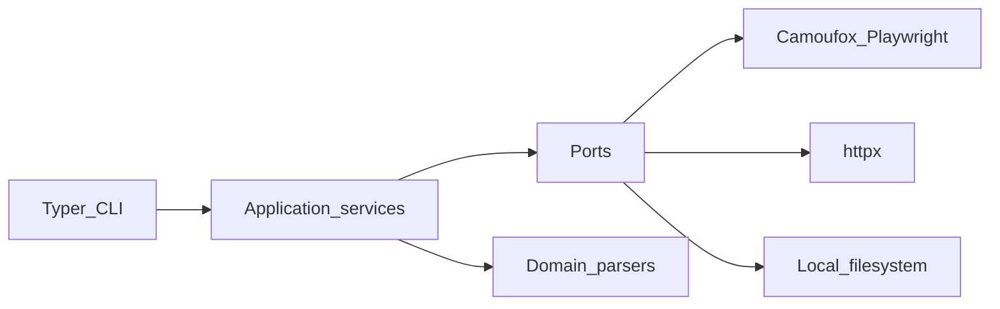

# Architecture

## Overview

- **Delivery**: `youtube_scrape.cli` composes settings, adapters, and application services.
- **Application**: orchestrates navigation, HTTP continuations, and file writes behind ports.
- **Domain**: pure parsing of embedded JSON, caption XML, and format selection rules.
- **Adapters**: Camoufox-backed browser session, retrying httpx client, local file sink, monotonic clock.

## Data flow (watch page)

1. Browser loads the watch URL and returns raw HTML.
2. `domain.json_extract` parses `ytInitialPlayerResponse` and `ytInitialData`.
3. `domain.player_parser` maps player JSON into `VideoMetadata` and caption track refs.
4. Comments use `domain.comments_extract` plus optional `youtubei/v1/next` continuations via `HttpClient`.
5. Transcripts fetch timedtext XML/JSON over HTTP using caption `baseUrl`.
6. **Thumbnails**: `ScrapeThumbnailsService` reads `VideoMetadata.thumbnails`, then `HttpClient.get_bytes` for each distinct URL into `--out-dir`.
7. Downloads resolve progressive URLs when unciphered; ciphered streams raise `UnsupportedFormatError` until the in-tree decipher path is completed.

## Packaging (PyInstaller, cross-OS)

CI currently builds a **Linux** PyInstaller folder bundle to keep the pipeline reliable. Shipping **macOS** and **Windows** artifacts usually requires OS-specific Playwright/Camoufox bundling or hooks (browser binaries, code signing on macOS). Extend `.github/workflows/ci.yml` with matrix jobs when those payloads are scripted and cached.

## Testing and review artifacts

Opt-in live integration runs write under [`tests/output/`](../tests/output/README.md) (gitignored blobs; README explains env vars).

## Configuration

Runtime defaults live in `youtube_scrape.settings.Settings` (environment prefix `YOUTUBE_SCRAPE_`). See `.env.example`.
